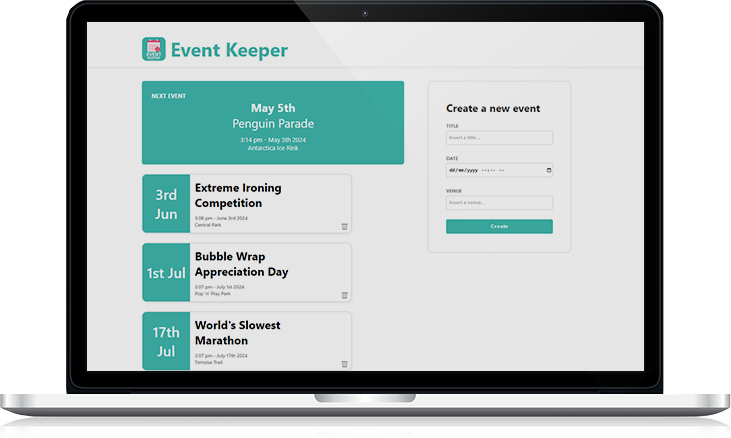

<div>
    <h1>
    Event Keeper by Alaa Tahhan</h1>
</div>



Event Keeper—a simple yet effective event management application. Built with React, Event Keeper provides a seamless way for users to add, view, and delete events through a clean and intuitive interface. It's designed to make event management straightforward and hassle-free, perfect for those who need a no-fuss solution.<br>[Click Here to View Demo](https://eventkeeper-alaa.netlify.app/)

## 🌟 Features

- 📅 **Event Management:** Add, view, and delete events with ease.
- 🔄 **Real-Time Updates:** The event list updates dynamically as events are added or removed.
- 🚨 **Alerts and Notifications:** Users receive alerts and error messages to confirm actions or inform about issues:
  - ✅ **Adding Events:** Confirmation upon successfully adding an event.
  - ❌ **Deleting Events:** Confirmation upon successfully deleting an event.
- 🕒 **Automatic Event Sorting:** Events are automatically sorted by proximity to the current date.

## 🛡️ Data Handling

- **🏠 Local Storage:** Events are temporarily stored locally for persistence during the session.
- **🖥️ Server-side Processing:** All events are processed and stored on a local server, ensuring data integrity and security.

## 🛠️ Tech Stack

### Frontend Technologies

<div align="left">

<table>
  <tr>
    <td align="center"><br>React</td>
    <td align="center"><br>JavaScript</td>
    <td align="center"><br>CSS</td>
  </tr>
</table>

</div>

### Backend Technologies

<div align="left">

<table>
  <tr>
    <td align="center"><br>Node.js</td>
    <td align="center"><br>Express</td>
    <td align="center"><br>MongoDB</td>
    <td align="center"><br>Mongoose</td>
  </tr>
</table>

</div>

## ⚙️ Setup and Installation

Ensure you have `npm` and `Node.js` installed before starting.

1. **Clone the repository:**
   ```bash
   git clone https://github.com/SoftwareEngineerAlaa/event-keeper.git
   ```
2. **Navigate to the project directory:**
   ```bash
   cd event-keeper
   ```
3. **Install dependencies:**
   ```bash
   npm install
   ```
4. **Start the server:**
   ```bash
   cd server
   nodemon
   # or
   node server.js
   # Output: 🚀 Server is listening to Port 3000
   ```
5. **Start the React application:**
   ```bash
   cd ../client
   npm start
   # Would you like to run the app on another port instead? » (Y/n)
   y
   # Output: Local: http://localhost:3001/
   ```

## 📖 Usage

Begin by navigating to the main page where you can view the upcoming events. Add new events using the "Create" button and fill in the event details. Events can be deleted using the trash icon associated with each event entry.

## 🚀 Possible Developments

- 🌦️ Provide weather forecasts on event days and suggest changes if the weather is likely to affect the event.
- 📅 Enable filtering of events by category, date, or tags for efficient organization and quick access.
- 🏷️ Allow users to categorize events (e.g., Work, Personal, Social) and add tags for better organization and filtering.
- 📤 Import and export events to and from various formats.
- 📢 Enable linking of events to social media accounts to automatically share updates or promote events on platforms like Facebook, Twitter, or LinkedIn.

## 🤝 Contribution

Contributions are highly appreciated! Please fork the repository and submit a pull request or open an issue to discuss potential changes or enhancements.

## 📞 Developer Contact

**Alaa Tahhan**

- [Portfolio](https://mohammadala.netlify.app/)
- [GitHub](https://github.com/SoftwareEngineerAlaa)
- [LinkedIn](https://www.linkedin.com/in/mohammad-ala-tahhan/)

Thank you for exploring Event Keeper!
